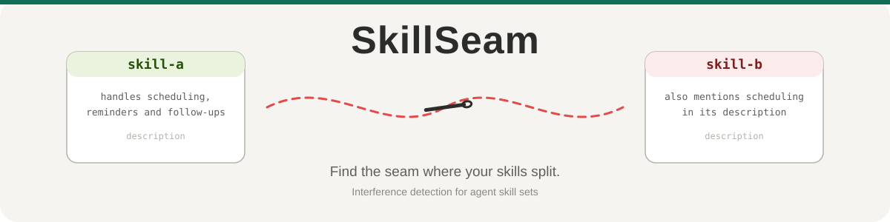

# SkillSeam

[English](README.md) | [简体中文](README.zh-CN.md) | [日本語](README.ja.md) | [한국어](README.ko.md) | **Español** | [Deutsch](README.de.md)

<p align="center">
  
</p>

Simula cómo tu agente elige skills y descubre cuál le roba las tareas a cuál. Antes de que lo descubran tus usuarios.

## El problema

Los runtimes de agentes como Claude Code y Codex cargan los skills leyendo apenas un par de líneas de description. Cuando llega una tarea, el agente elige el skill que suena más parecido.

Funciona bien hasta que dos descriptions se solapan. En nuestra demo de hospital, la description de un skill de reservas decía que también atendía "consultas de informes de visión". El skill de interpretación de informes era el responsable real. Un paciente pide interpretar un informe, responde el skill de reservas, y luego inventa cosas. No hay error ni registro. Nos enteramos porque los pacientes se quejaron.

SkillSeam reproduce ese proceso de selección antes de que publiques. En una demo de 6 skills y 40 tareas, detectó los 4 conflictos plantados con votos de 5/5, y todas las tareas limpias pasaron. Cada informe de conflicto señala las palabras exactas de la description del ladrón que causaron el robo.

## Inicio rápido (web, sin instalar nada)

Abre [https://snow7-g.github.io/SkillSeam/](https://snow7-g.github.io/SkillSeam/), pulsa el botón de demo y tendrás un mapa de calor real en diez segundos. Luego pega tus skills, añade una API key (se queda en tu navegador, las peticiones van directas a tu proveedor) y ejecuta.

¿Tus skills son archivos SKILL.md? Pulsa el botón de carpeta (选择技能文件夹) y elige el directorio: se analiza dentro de tu navegador, no se sube nada. O imprímelos en formato listo para pegar:

```bash
python3 skill_seam.py export ~/.agents/skills
```

## CLI (directorios locales, gates de CI)

```bash
git clone https://github.com/Snow7-G/SkillSeam && cd SkillSeam
echo '{"base_url": "https://.../v1", "api_key": "sk-...", "model": "..."}' > .atlasrc.json
python3 skill_seam.py ~/.agents/skills
open output/report.html
```

Códigos de salida: 0 sin conflictos, 1 conflictos encontrados, 2 configuración incorrecta. El gate de CI cabe en una línea:

```bash
python3 skill_seam.py ./skills --tasks ci-tasks.json
```

## Las preguntas reales ganan a las generadas

Primero, una limitación honesta: las tareas de prueba generadas por LLM tienen sesgo. El modelo que las escribe sabe qué skill debería ganar, así que suelen pasar. En nuestra demo, las tareas generadas encontraron 0 conflictos y las preguntas reales de usuarios encontraron 4. Mismos skills, mismo modelo.

Por eso la herramienta incluye tres formas de recopilar preguntas reales:

```bash
# Configuración única: cada prompt que envías a Claude Code se registra localmente, en silencio
python3 skill_seam.py capture --install-claude

# En el momento en que cacen a tu agente eligiendo mal, guarda el incidente para siempre
python3 skill_seam.py mark "consulta mis puntos de socio en la revisión" followup-reminder

# Recoge los prompts registrados (o logs de sesiones de Codex) en un borrador etiquetado
python3 skill_seam.py harvest ./skills --codex --label --out tasks-draft.json
```

Revisa el borrador, rellena el skill esperado, ejecuta. Diez incidentes reales crean un mejor conjunto de tareas que cualquier generador.

Las tareas generadas siguen sirviendo como smoke test. Solo no confíes en ellas para probar la ausencia de conflictos.

## Cómo funciona

1. Escanea el directorio, analiza el frontmatter de cada SKILL.md y revisa el formato.
2. Construye un set de tareas: preguntas claras por skill, más otras deliberadamente ambiguas en las fronteras donde dos skills se solapan.
3. Reproduce la selección: el modelo solo ve los nombres y descriptions, con el formato real de inyección de los agentes, y elige un skill por tarea. Cada tarea corre 5 veces a temperature 0.7.
4. Agrega por voto mayoritario. Una tarea cuenta como conflicto real solo si al menos 4 de 5 ejecuciones coinciden en el skill equivocado. Por debajo se marca como inestable, porque es ruido del modelo y contaminaría el informe.

El informe es una página HTML autocontenida con una matriz de confusión. Si hay conflictos, también genera reescrituras de description (antes y después) para aplicar y volver a probar.

## Comparación

| Herramienta | Qué comprueba | Alcance |
|---|---|---|
| agnix | Reglas de formato (frontmatter, nombres) | Archivo individual |
| skilltest | Si un skill se activa por sí solo | Skill individual |
| SkillSpector (NVIDIA) | Seguridad: inyección, exfiltración, supply chain | Skill individual |
| **SkillSeam** | Comportamiento de selección tras componer: quién roba qué | El conjunto completo |

Se complementan. Ejecuta lint y análisis de seguridad por skill, y SkillSeam sobre el conjunto.

## Advertencias

La simulación es fiel al formato de inyección pero no maneja procesos reales de agentes. Las diferencias entre runtimes (¿Codex elige distinto que Claude?) están en la hoja de ruta. El parser de sesiones de Codex es tolerante, así que salidas de herramientas pueden colarse entre los candidatos. La interfaz web está en chino por ahora.

## El nombre

Los conflictos no viven dentro de un skill. Viven en la costura entre dos skills, donde la tela aguanta hasta que alguien tira. SkillSeam revisa las costuras.

El informe se llama Sirens Report, por la Lorelei. Heiné lo dijo mejor que nadie:

> Ich weiß nicht, was soll es bedeuten,
> dass ich so traurig bin.
>
> Una doncella se sienta allá arriba, peina su cabello dorado y canta. El barquero escucha la canción y ya no ve las rocas.

Cada description canta. Algunas canciones llevan tus tareas contra las rocas.

## Desarrollo

```bash
python3 tests/test_atlas.py   # 58 tests, solo stdlib
node tests/web_smoke.cjs      # 19 aserciones web, node >= 18
```

CI ejecuta ambos en Python 3.10, 3.12 y 3.13. Lee CONTRIBUTING.md antes de abrir un PR.

## Licencia

MIT
