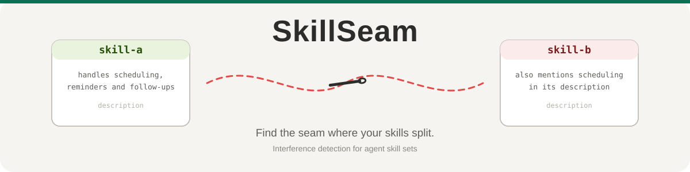
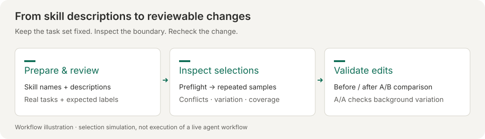

<p align="center">
  
</p>

<p align="center">
  <strong>English</strong> ·
  <a href="README.zh-CN.md">简体中文</a> ·
  <a href="README.ja.md">日本語</a> ·
  <a href="README.ko.md">한국어</a> ·
  <a href="README.es.md">Español</a> ·
  <a href="README.de.md">Deutsch</a>
</p>

<p align="center">
  <a href="https://github.com/Snow7-G/SkillSeam/actions/workflows/ci.yml"></a>
  <a href="LICENSE"></a>
  <a href="pyproject.toml"></a>
  <a href="tests/test_atlas.py"></a>
</p>

Simulate the way your agent picks skills, and find out which skill steals whose tasks. Before your users find out.

<p align="center">
  <a href="https://snow7-g.github.io/SkillSeam/?lang=en"><strong>Try the interactive example</strong></a> ·
  <a href="#quick-start-web-no-install">Start with your skills</a> ·
  <a href="docs/comparison.md">Comparison guide</a> ·
  <a href="CONTRIBUTING.md">Contribute</a>
</p>



### Choose your starting point

| Your goal | Web entry | What you get |
|---|---|---|
| Understand the report | **Explore an example** | Historical results; no API key or model calls |
| Find overlapping descriptions | **Check my skills** | Selection matrix, conflicts and a next-step summary |
| Check whether an edit helps | **Validate description edits** | Reviewed tasks, paired A/B outcomes and description differences |

The web page runs locally in your browser. Model requests go directly to the provider you configure; skill names, descriptions and task text are included in those requests. This is a **selection simulation**, not a run of the full agent or its tools.


## Connection checks and web review

Real runs preflight the endpoint once before batch work. Run `python3 skill_seam.py --check-connection --out output/connection` to diagnose connectivity separately. Failures write sanitized `preflight.json` and exit 2 without evaluating tasks.

The web UI now supports baseline/candidate comparison and a task-review table: import a draft, confirm each label, apply reviewed tasks, then compare. [Instructions and diagnostic limits](docs/comparison.md#web-comparison-and-task-review).

## The problem

Agent runtimes like Claude Code and Codex load skills by reading one or two lines of description. When a task comes in, the agent picks whichever skill sounds closest.

That works fine until two descriptions overlap. In our hospital demo, a booking skill's description claimed it also handled "vision report inquiries". The report-reading skill owned that job. So a patient asks for a report reading, the booking skill answers, and then it makes things up. Nothing errors, and nothing gets logged. We only found out because patients complained.

SkillSeam replays that selection process before you ship. Both bundled demos are real 40-task runs over 6 ophthalmology support skills: the Chinese set surfaces 4 boundary problems, the English set 6 — every one of them unanimous at 5/5, with no flaky rows. Each conflict report highlights overlapping keywords as investigation clues; a controlled comparison is needed to test whether editing them improves selection.

## Before/after comparison

Use a fixed, reviewed task set to check whether description edits improve routing or introduce regressions:

```bash
python3 skill_seam.py ./skills-candidate --baseline ./skills-baseline --tasks regression-tasks.json --out output/comparison
```

Both collections must have the same skill names. Comparison exits: 0 no stable regressions, 1 regression, 2 failed evaluation/input, 3 unstable pairs requiring review. Improvements never cancel regressions; 0 does not mean no pre-existing conflicts. [Protocol, artifacts and limitations](docs/comparison.md).

## Quick start (web, no install)

1. Open the [web app](https://snow7-g.github.io/SkillSeam/?lang=en) and choose **Explore an example** to inspect a historical result without a key.
2. Choose **Check my skills** to import your own skills and supply tasks with expected labels. Visiting the example and returning restores your inputs.
3. Review tasks: filter unreviewed, invalid or gray-zone rows; use the searchable skill suggestions; confirm each label. Editing a task clears its confirmation.
4. Configure your provider and test the connection, then run the check. The report starts with a conclusion and a suggested next action.

For before/after validation, choose **Validate description edits**, supply both catalogs and apply the reviewed tasks. **A/A** uses the same candidate catalog twice to inspect sampling variation; it is not evidence that an edit improved routing.

Your skills live as SKILL.md files? Click the folder button (选择技能文件夹) and pick the directory — it is parsed inside your browser, nothing is uploaded. Or print them in paste-ready form:

```bash
python3 skill_seam.py export ~/.agents/skills
# booking-desk: Handles clinic appointment booking, rescheduling and cancellations
# report-reader: Interprets ophthalmology test reports and follow-up advice
```

The web UI ships in Chinese and English: switch in the top-left, or pass `?lang=zh` / `?lang=en`.

Each language ships its own demo dataset, both from committed runs. Reproduce the English one:

```bash
python3 skill_seam.py demo-skills-en --tasks examples/tasks-demo-en.json
```

## CLI (local directories, CI gates)

```bash
git clone https://github.com/Snow7-G/SkillSeam && cd SkillSeam
echo '{"base_url": "https://.../v1", "api_key": "YOUR_API_KEY_HERE", "model": "..."}' > .atlasrc.json
python3 skill_seam.py ~/.agents/skills
open output/report.html
```

Exit codes: 0 means no stable conflicts, 1 means stable conflicts found, and 2 means a configuration/argument error or insufficient valid samples. Every task must have at least 80% valid selections (4 of 5); ERROR and INVALID do not count. Insufficient coverage takes precedence over conflicts. Diagnostic reports are still written. Valid but unstable selections keep the existing aggregation rules; exit 0 does not guarantee every task is stable.

That's a CI gate in one line:

```bash
python3 skill_seam.py ./skills --tasks ci-tasks.json
```

## Read the result before accepting a change

| Comparison outcome | What to do next |
|---|---|
| **Failed / stopped** | Check diagnostics and retry; incomplete samples cannot establish improvement |
| **Regressed** | Inspect the affected task and description boundary; improvements do not cancel regressions |
| **Needs review** | Check the labels and unstable selections before drawing a conclusion |
| **Persistent errors** | Address remaining misrouting, even when no new regression appeared |
| **No stable regressions** | Check remaining errors and uncovered skills before accepting the edit |

Coverage shows positive, gray-zone and other tasks per skill, NONE tasks, uncovered skills and duplicate task text. It measures the supplied test set, not real-world completeness.

<details>
<summary><strong>Artifacts you can inspect and keep</strong></summary>

- `run.json`: current CLI run ID, status, timestamps and exit code.
- `preflight.json`: sanitized connection diagnosis for real runs.
- `comparison.json` + `report.html`: paired votes, task snapshots, description changes and coverage.
- `history/`: previous CLI artifacts; a task file reused as current input stays in place and is copied into history.

Single checks produce `results.json` and `report.html`. Web task review exports JSON. API keys are not included in comparison exports; task text and descriptions are, so review the content before sharing it.

</details>

## Real queries beat generated ones

One honest limitation first: the generated test tasks are biased. The model that writes them knows which skill should win, so they tend to pass. On our demo, generated tasks found 0 conflicts while real user questions found 4. Same skill set, same model. The only thing that changed was where the questions came from.

SkillSeam ships with three ways to collect real questions instead:

```bash
# One-time setup: every prompt you send to Claude Code gets logged locally, silently
python3 skill_seam.py capture --install-claude

# The moment you catch your agent picking the wrong skill, keep it forever
python3 skill_seam.py mark "check my membership points at my follow-up visit" followup-reminder

# Harvest logged prompts (or Codex session logs) into a labeled task draft
python3 skill_seam.py harvest ./skills --codex --label --out tasks-draft.json
```

Review the draft, fill in the expected skill, run. Ten real incidents make a better task set than any generator.

Generated tasks still have a use: smoke testing. Just don't trust them to prove the absence of conflicts.

## How it works

1. Scan the skill directory, parse each SKILL.md frontmatter, and lint the format.
2. Build a task set: clear questions per skill, plus deliberately ambiguous ones at the boundaries where two skills overlap.
3. Replay selection: the model sees only the names and descriptions, formatted the way agents inject them, and picks a skill for each task. Every task runs 5 times at temperature 0.7.
4. Aggregate with majority vote. A task counts as a real conflict only when at least 4 of 5 runs agree on the wrong skill. Below that we mark it unstable and require review: model variation, task ambiguity, or overlapping skill boundaries may all contribute.

The report ships as a single self-contained HTML page with a confusion matrix. If conflicts exist, it also generates description rewrites (before and after) that you can apply and re-test.

## How it compares

| Tool | What it checks | Scope |
|---|---|---|
| agnix | Format rules (frontmatter, naming) | Single file |
| skilltest | Whether one skill triggers on its own | Single skill |
| SkillSpector (NVIDIA) | Security: injection, exfiltration, supply chain | Single skill |
| **SkillSeam** | Selection behavior after composition: who steals whose tasks | The whole skill set |

These complement each other. Run lint and security scans per skill, then run SkillSeam on the set.

## Caveats

The simulation is faithful to the injection format but doesn't drive real agent processes. Cross-runtime differences (does Codex pick differently than Claude?) are on the roadmap. The Codex session parser is a lenient extractor, so tool outputs may sneak into harvest candidates. The web UI ships in Chinese and English.

## The name

Conflicts don't live inside a skill. They live in the seam between two skills, where the fabric holds until someone pulls. SkillSeam checks the seams.

**Note on the name.** An unrelated paper shares it: *SkillSeam: Six Principles for Auditing Agent Skill Collections* (Kang Ruiyuan, X32 Studio, [arXiv:2609.13321](https://arxiv.org/abs/2609.13321)), published in September 2026, before this project existed. It audits skill collections through controlled perturbation and ships with an [installable skill](https://github.com/X32Studio/best-practice-for-skills-system). This project is independent of it, is not its measurement instrument, and took its name from the seam metaphor without knowing the paper existed. If you arrived here from the paper, that is why the name looks familiar. [How the two differ →](research/protocol-alignment.md)


The detection report is called the Sirens Report, after the Lorelei. Heine put it best:

> Ich weiß nicht, was soll es bedeuten,
> dass ich so traurig bin.
>
> A maiden sits up there, combing her golden hair and singing. The boatman hears the song and does not see the rocks.

Every description sings. Some songs lure your tasks onto the rocks.

## Development

```bash
python3 tests/test_atlas.py   # 125 tests, stdlib only
node tests/web_smoke.cjs      # 168 web assertions, node >= 18
```

CI tests the CLI on Python 3.10, 3.12 and 3.13, checks web logic on Node 20, and runs 268 YAML differential cases. See CONTRIBUTING.md before opening a PR.

## License

MIT
